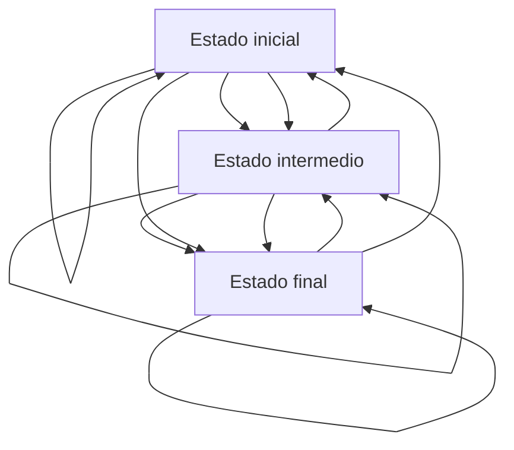

# **Punteros**
## **¿Qué son los punteros?**
Un puntero es una variable que almacena la dirección de memoria de un objeto. Los punteros se usan ampliamente en C y C++ para tres propósitos principales: para asignar nuevos objetos en el montón, para pasar funciones a otras funciones.

<center>

[![Heap y Stack](data:image/jpeg;base64,/9j/4AAQSkZJRgABAQAAAQABAAD/2wCEAAkGBxIQERIQExIQFhEVEBUQEhYWFhIYEhUSFxEWGhUYFRgYKCggGBslHRgTITEjJSorLy46GB8zODMtOCgwLisBCgoKDg0OGxAQGzAlICUvNTctLzcvMC8rLTctLTctKy0tLS0tLy0tLS0tLS0rLS0uLS0vKy0yLS0tLS0tLystL//AABEIALIBHAMBIgACEQEDEQH/xAAbAAEAAwEBAQEAAAAAAAAAAAAAAwQFBgECB//EAEAQAAIBAgIECgcHAwUBAQAAAAECAwARBBIFEyExFBUiM1FSU5GS0QYyQXFygbIjQmFzdKHBk6LCYoKx0vA0JP/EABoBAQADAQEBAAAAAAAAAAAAAAABAgQDBQb/xAA3EQACAQEEBggFAwUBAAAAAAAAAQIRAxIhMQQTQVGR8DIzYXGBobHRIlJTkuEUotIFFWLB8UL/2gAMAwEAAhEDEQA/AP1vRWjYDBCdTDzKfcTqD8KtcWQdjD4E8q90R/8APD+TH9Aq3QGE0+BXWApEDFNHh5Bqdoll1erUDLdr6xNouNp27DbROjYBt1MP9NPKsbS3o202KGISUIpjGdCuYNNGkqwP0WXWkke3InRWdoj0I1JjzmBkSZphGI7IHOHiQFV3Ah49Zu3m42i9XpGmZSsq5G+VwogOJ1MeqERm2w5WyBM21GAYG3sIBoy4QNCupivPfV/ZrttGXN9mzYDXMR+gkgMR1sV48IMLmEdnK8CeArmG0rnYPY9AHsvUy+hLhHQTRR5tZzUbKis2DMOcLmvmJ5TbdvTfbU3YUzFZbjreLIOxh8CeVVMJHhZHmjWGLNC6xyfZqAGaJJBbZt5LrWFhPQwxthmVoV1M7SgBGZVVjHnWNWJVM2Q8pQpGY77nN9aY9EWnlmkzwsskrSCOWMvGCcJDCrkAjloYiyn/AFkbDtpdhXMVlTI6biyDsYfAnlVSKLCtLJAIYtZGkbuNWtssmfLY22+o1c/N6GORMC8D6xoy0ksWeaREMP2cjMSCn2bW2bM3s23jk9BnaNI2mRwseGRlZWySCBMQtmF932qsN9jGPeIpDeKy3HX8WQdjD4E8q84sg7GHwJ5VjaB9HGwuIebPGQ0CRNZWMjMiRqGMjlnAAQ8nMRyr7Dct0tVaWwsqlPiyDsYfAnlTiyDsYfAnlVylQSU+LIOxh8CeVOLIOxh8CeVXKUBT4sg7GHwJ5U4sg7GHwJ5VcpQFPiyDsYfAnlTiyDsYfAnlVylAU+LIOxh8CeVOLIOxh8CeVXKUBU4sg7GHwJ5VnTPgk1oZIgYghkGquQH5uwC8u5FhlvtFt9blYWk9CmXERTB7KAomXbyxFJrYLdGWS5/EEiolVLA6WSs2/jdF7Y0yeaql20rhU0uLIOxh8CeVVYsPhnj1ohjyWLbYcrWF78lgCNx3isHRPogYiokaF4xNHMVCWRimHkjZivq5mZkbd9223fSL0RkEkMmsiOrW18lnsdfmAO8qdaNh6u6qKU/lO7srDFK0ruweOHKrluqbKnCFcO4iiy4gqIvsl25omkW+zZyVar/FkHYw+BPKuXwnog6KE1qJbILxoV2phZ4jLv51jMGJ/wBAr3CeiLRiGxgGrnE2xGI2LEGIRiVBYRtuAIuCGvmzQpWm2PmTKy0euFp5Ptf47c+w08bPgoGKOkQKqGa0OZUVjZTIyqRGCQdrWGw9FSR8EMckmpjyJI8b2hucySFWsqgk7egVX0joSR3xGSRFjxUSxzBlZmWwKMY7EDahtY7iL7d1ZOP9F5FGIdcrNKZ1URrZ2E8yMomZjZlS1/mbDpluaeWHP/RZ2WjySTnR/jHYqY1VavftOu4sg7GHwJ5VAmEwzFlEcBZDZwFjJUkA2Yey4IO3prBf0UYvM+dCZJC5zBiJF4SkoSUXsygKU3HYdlhcHT0PoTUSySWgGdIx9nHkKlUClVNzyOTe341Kc28Uc5WdiotqdX3d354GjxZB2MPgTypxZB2MPgTyq5Srmcp8WQdjD4E8q430ywMInQamHmR9xeu/4V31cV6ac+n5I+t6A3cOTqcMLkDg4OwkbQqW3e8195T1n8b+dRwc1hv04+mOpK6xyOUsxlPWfxv50ynrP4386UqxAynrP4386ZT1n8b+dKUAynrP4386ZT1n8b+dKUAynrP4386ZT1n8b+dKUAynrP4386ZT1n8b+de15QEuAJzuLsRlQ7STtJe+/wBwrQqhgecf4I/qkq/XKeZ0jkKUpVSwpSlAKUpQFPHsQosSOXbZ0ZTVPXN1j3mrelPVX4/8GqhXlaVJq1dGbLKKuIk1zdY95prm6x7zUdKz35b3xOt1EmubrHvNNc3WPeahkcKCx3AEn3AXNctorSGIiJ1ySKJWhxBMpzCJZSVmjUqSEWMiK1+0OypTm9r4lWkth1+ubrHvNNc3WPea5KHTWJLszZRG0GFZA0TgIZMVOkznbmIVRCWB2LmUnKLk+JpvFsWtHHlVsOgOqlOsE2kZ8OZF5QsojSKW23Y2+xBqXfX/AK8yKx3eR12ubrHvNNc3WPea5aLTeIJClEDB0S2rlvKTjJYXaPbyQqIsh9awcEkCzGjpvH4mXCTcgq4wuIitHrg3CFwMpkKEEB01hVVuN6kjaRZ8e/zDcdx2+ubrHvNNc3WPea+DXlVvy3viXuok1zdY95prm6x7zUdKX5b3xF1GhgGJzXJO7f8AOuW9NOfT8kfW9dPo373y/muY9NOfT8kfW9etozbslXnExWq+Nm5BzWG/Tj6Y6lqKDmsN+nH0x1BpY/Z29hYA+7af4FbYKtEZZOlWS8Mi7SPxr504ZF2kfjXzrFz0z131SOd9m1wyLtI/GvnThkXaR+NfOsXPXuamqQvs2eGRdpH4186cMi7SPxr51i569zU1SF9mzwyLtI/GvnThkXaR+NfOsbNXmamqF9m4uKjJsJIyTuAZSalrnSb7DW3gmJjjJ2kxqT7yoqk4KJaMqlrCXzSW36tLe+8lV8HJiS8IaNhHqhrSzRH7TKb7FJN7hdoNtp2e2rWB5x/gj+qSss6dlQSZ4blZWC2JGaPX4hVtdbZgsSm19uYdNcJ9Lgdo5Holx1l+zBN3UkGILZVyqxFyTnYFxYiwZQ20GvqXhgYqqllLkZ8yDkaiIXte45ZmtltbKDtvtk46fOiakENIyE6xQUAdF5QYDl2ZmKAk2XZe9fU+lpFkRBBcNK0YbWKoAWSNbnMBtOZmCgkkIbX3VQsVFGOAUhWvlC2Zos9sq7SAShbPf/b7c1e6bxOPWTLh4AyCBmLlocpl1UpCBWIYHOsIuTl+0/AkeaN03OyorQAyFImYmQKLyaknkBcwUax7GxH2ZBINS4fTsr5f/wA1gSS15AWVQ0IOYKDaQa03RreodvQBnRSaT1ksjRuIyAERThiVUYvGWKgtbWGLgJNzaxf7wAHxNDpMrKeWJMgNongyPJrIyoh1h5KBdarZspNxa++tGf0idIjLqL8gMEDPmzZWJRjlsrjLbL07LkkA2sdpNkl1Spfkq2e5NryICMtt2UnlA22W9hsBb0meSnx/4NVGr+lPVX4/8GrPryNL61m6x6CPaV5Ssx1F6gxmK1YXYSWlSJQLXu7AE7fYBmY/gpqeqWksOz6plsWjnjksTYZblX+YRnI6SANm+pRDyIcFpyGXJtKCSNZYS5QCVGDspj2m/JRmsbEDbbfaQ6VGsSIRyMXjeVGUxFGjQoCwObcTIlr77/hWbJ6KxvCMO0jmFYosOq2UWhhLGMX2ktm1ZJ3HVgW2tfUjwJDyS6wmV4kiDWFkCBrFV3bWdmPTsHsFXdzYVV4r8erq9bqp8uv4OOauZNfqdgz7Rn2X/C+6ruBxglUsARaSSIg7w0crI3yupI6QQarxaKRRhkBbJh/UBN8zCIorOd7EBnO3eSDvFfeicM0aNntmaeaU23APKxQe8LkB/EGod2mAVS9SvKVQue0rylAX9Gfe+X81zHppz6fkj63rp9G/e+X81zHppz6fkj63r2NF6pePqzDbdNm5BzWG/Tj6Y6raZ5sfGP8Ahqswc1hv04+mOq2l4y0RsCSGDWG+24/83+Vb7LNGS02nJafnnWI6hWMmV8tsvr6tsgIKte7WHsHSR7aekZMUyyxrrQcmIKsgRfYpgVWPt9YbOg3INq19cvWHeK8169Ze8Vsdm2ZVNGRpM4p1kRNYQ2sWxCIGgOGOQo9gVlMmUWJFsz7AACBwtiWEbBOHRzQqEbkRiOESMEA5F2WQ2tc3J+8a19evWXvFNevWXvFNWTrEeztLmGTVZNmbNnzb9trbN1qysVh31zvkctr0eORQpaOBcLZgCfbn1vJ231o2WvbU169Ze8U169Ze8VLgyFNGQuGmnjjTEIpkM41xypkSFAHtHvJD5UU7SbySWNlFTSYUhsVOIEZggigQqlpMozFjs2ZpGsb32RA1o69esveKa9esveKjVjWI90bhRBFHEDcIoUmwGZvvMQNlybk++t7BYlkjjzocmrSzpdgBlFs67194uPxFYSygmwNz7ANpPuArqcHGVjjU71RVPvCgGudslFIvZtybxJ9GyBmZlIKmOOxBBB5Um4iqWN9JkjPqOQHbPtjByLHiWLKM3Thn2Gx/CpYMCDJIyMY3yoSyWsxu/rqdjbhtIv0EVK7au+thUrmzGSNMylhuZ02sp/HlAW2kVklGrw59/DHsNMZUWPPt48SvL6QqNYBDMzJrL2AyciSVeU+5b6pjt2bQN+ypX9IIlSeRw6xwRySSMcpGWJpFksFJNwY2G21/ZereEwsBUFFjZTnIbY987Fn5Rve5Zr7fbVgQIL8ldts2wbbbr9PsrmdDnsF6Wo6JniZZi+qZEeN1EnCNTZXuuYE5WBsOSwNvZUGj/TiKWGOUxTAvHEzKpjYLLLDBKIwSQW5M8ZzWC/iDya6c4ZCcxRC173yi99m2/TyV7h0V8rg4xujQbMuxV3Xvb3X20BgN6ZwKjSNHiFCI0jgiIssSxu7PscggBHFgSxtsBG2ocT6ax3tEhJE/BpM2UBZRiIY5EJUmzKJATsttXbXTNhYza6JsIYckbCL2I/EXPfXpw6dRN+bcN9wSffsHcKAh0p6q/H/g1Z9X9K+qvx/4NWdXkaZ1rN9j0Ee1XmxFtg2n9qllawJrPrytKt5WdIx2mmzgniybhLfh3U4S3/hUNBWH9RPe+J2uLcTcJb/wpwlv/CuYw/pXG8GGnEcn28scWTk54xI6qHfb6vLiOzb9ovTWs2kogQC4uWCKLNmZirMuUWu1wrkEbDlNt1XdpaptVeHeUTg9xo8Jb/wpwlv/AArOOk4gpfOMg2lrNlyje17Wyf6/V/GrdU19pvZZRjuJuEt+HdUsOIvsOw/tVSlWjpVpF1rUOzizTr2o4muAa+q9ZOqqZjQ0X975fzXM+mnPp+SPreul0X975fzXNemnPr+SPreva0Xql4+rMFt02bkHNYb9OPpjqWooOaw36cfTHUtbY5GV5sXpelqWqcBiL0vS1LUwGIvS9LUtTAYi9L0tS1MBiL0palAS4HnH+CP6pKv1QwPOP8Ef1SVfqk+lwLxyKE2jlLF0JjkO0slrMf8AWp5Le8i/QRXy2Kkj5xLr2kYJX/cm1l+WYdJFaNKi9vx553oXd3PPgRQzK6hlZWU7ipBB9xFS1Qm0epYuhaOQ7SyW5R/1qeS/vIv0EV8nFSR84l17SMEj/cm1l+WYdJFLtej+fz69hF6mfPtziaNKihmV1DIysp3FSCD7iKlqpco6V9Vfj/was+tHSvqr8f8Ag1ZtePpfWvuRvsegiOf1TVJI2O4Xq5iPVNUUkI3G1eFprgrWN/KmzPM12dbuBJqG6r91NS3Vbur54S3WanCW6zVjv2H+X7Tp8XZ5mLh/Q+KMIAsvJTDKCbX/APzPEytu9Z9TAH6REtrWr7wvossciSgzsyFGBYqblIp4wXIW7EieUkk3JC7d99BdKXcxh3LKQrWEhVWK5gGYclTlINifvL0i/r48h1jLNmZWZd+5ct/qFXv2VKO9l/jku/ZtKKO6nmZuJ9Ew8AwpbEiJYWgVQI+TGyBABdTcqosGN2G3btN9rUt1W7q+eEP1mpwlus1VdrYv5v2llFrKnmfWobqv3V8tGw3i3v2U4S3Wavl5WO83+dVlOxo6Vr4U8ifi5qX4PVFS1Dh/VFS171n0I9y9DNLNl/Rf3vl/Nc16ac+v5I+t66XRf3vl/Nc16ac+n5I+t69zROqXj6s8+26bNyDmsN+nH0x1DpNyE2Ei7BbjfbaT/wAW+dTQc1hv04+mOq2mD9mPjH/DVvss0ZJ7TJ1a9Ve4V5q16q9wr5zVBjpHEbmMXkCllHWI25fna1/ZetmJnwLOrXqr3CvdWvVXuFYA0lOXj+zkszBtsbhdU7y5Adl1dVWMsGK2LW23sKw175GkEpkaHBuhClVjl17NiRs5sBTGGDHlKLcraKreZN1HUateqvcKateqvcKx9EsQcUAJbcIzR6wS7QcPF6pktmGcP7be6ppw8kMiSZlzKVuqcoA+0KjOTU1ZFEaWrXqr3CvNWvVXuFcvitaysBGytq5Fw2rjkRBLruS5Tbqzze1vYHO4kV0xaibYaR9hFG4AHpAsR7iN1b2EctGjHeUVj7yoJrns1b+j+ai/KT6BXO1WCL2eZdwPOP8ABH9UlX6oYHnH+CP6pKv1kn0uBpjkKUpVCwpSlAUJ9HqWzoWjkO0slhm+NTyX+Yv0EV8HEyR86mZe0jBI/wBybWX5Zh0kVpUq17fjzzvRW7uwM3HzK8aMjKyl9hBBB5Le0VRqbS2CWwdbo5faV2ZuS3rDc3vIvWdrnT11uOugJ8Sbx8r/ACrydLhetXdeOGGT8Nj7q17DbYTpBXl47Px6dpPP6rVm1feVWQlSCDuIIIqpFIoG1MxvvzEbPlXzH9SS1sYydMNtd+WCbr4HoWL+Gqx4EdKsa6Lsv7zTWx9l/e1efch9SPCf8Dree709zCxGjZCuKiV1VZs5V+VrIy8IU2Atm5QzXup229l6qvoBiWIMKBs1o1U6sArAMp3XDals2wbHt7Lnp9dF2X97U10XZf3muiaWKtI8J/w59auPZ6e5z+C0IEmWYiLYJsqAcmMyNCfs+jm2JNhcu269bFWNdF2X95prouy/vaqtRedpHhP+BKwyXp7lelWNdF2X95qOWRSNiZTffmJ2fOqSjFJu+n2Un/uCXFotV7vT3L0HqrUlRYf1VqSvprLoR7l6GSWbNHRX3vl/Nc16ac+n5I+t66TRX3vl/Nc36ac+n5I+t693ROpj4+rPOtumzcg5rDfpx9MdVtND7K/QwJ920fzVmDmsN+nH0x1LW+DpRmSarVHJ5qZq6TgUXZReBPKnAIeyi8CeVaddHccdU95zeamauk4BD2UXgTypwCHsovAnlTXR3Map7zm81M1dJwCHsovAnlTgEPZReBPKmujuY1T3nN5qZq6TgEPZReBPKnAIeyi8CeVNdHcxqnvObL102BUiKMHYRGgI6CFF68TBxKbiOMEbiEUEfOp652lopZF4QccyXA84/wAEf1SVfqhgecf4I/qkq/WefS4HeOQpSlULClKUApSlAUdLeovx/wCDVmVp6W9Rfj/wasuvF03rX3I9Cw6CKuIwaXMtrPYi4Nrj8R7fZv6B0VUvWliPUas6LJblO4Pw3FvfmFfO/wBVv2trBN5RoqtLCuVZNcKmuwUYJ0WbPm9Z2msO0giACm2IVmzLmUKFfay3Fxe1a+SLtJP6Y/7UyRdpJ/TH/avPjYTi61j98P5HZtNUx4M5uNMRDkhTMyqUCEqoj1QwrA5j7BrQuwG4uPZUmB4S2rzPKFzEvyY8wtEOSSUAtm23A6dpFdBki7WT+mP+1MkXayf0x/2q+rk/k++z3Z9LPb3lKd/B+xyuAfFImFjInJWOETF8hzNZ1lB5NyVspzZhe4tm5Va+hnkMf2uYuDlzEAZwAOUFspUE32EXHSRYnTyRdrJ/TH/amSLtZP6Y/wC1VdjJ/L99n/ImOG/gyG9L1Nki7ST+mP8AtUcuS3JdyfhsLe/Ma5S0eSVW4/fB+Sk35F73NGaMHqrUlR4f1Fr7r6iy6Ee5ehjlmzS0V975fzXNemnPp+SPreul0Tub5fzXNemnPp+SPrevf0TqY+Pqzzrbps3IOaw36cfTHUjEAXNgBtJO4Co4Oaw36cfTHUGljyB+Li/yuf8AkCt8FWiMknSrJOHR9b9m8q84dH1v7W8qxs1M1d9WjnfZs8Oj639reVOHR9b+1vKsbNXy8yra5AuQouQLk7gOk01aF9m3w6Prf2t5U4dH1v7W8qw1mUkgMCV9YAgkX3XHsr7zU1aF9mzw6Prf2t5U4dH1v7W8q55dIwkgCWIk+qA6XPqbhfbzkfjXpFWM1NWhfZtDGxnZmHzBA7zViudzVt4E3ijJ3mNCfCKpOCRaMmy5gecf4I/qkq/VDA84/wAEf1SVfrhPpcDtHIUpSqFhSlKAUpSgKOlvUX4/8GrLrT0v6i/H/g1ZdeJp3XPuR6Gj9BEeJ9Rqyb1r4n1GrFvXzP8AVX8ce7/Ztssj7vWL6T4mVBh9SWzHEksq2vKiYXESmPb1jGorXvS9ebGai6nRqpzOD025nds32Eww7QmQDVxROcYFkO42kEEZFze8qjZuqVtOM5htlU62MlAx1kitCzZk68ZNlFxtseix6LNTNXRW0a4rz8P+8c8Slx7+efY5x9OSFEmyrYB3ssilG/8Ays2VshYgKbbSPxt7K2dF4wy631SEl1Sul8kg1aMWXfuLMpsTtQ7fYLWamaolaxdKKnj2880RKi1tPq9L18XpeuVVvLmzhvUWpaiw3qLUlfWWb+CPcvQyPNmnonc3vH81zXppz6/kj63rpdE7m94/mua9NOfT8kfW9fQaH1MfH1Z5tv1jNyDmsN+nH0x1V0zzY+Mf8NVqDmsN+nH0x1X0tEWjOUXIIa3tI9tu+vQss0ZLTaYuaviUZlK3IuCLjeLjePxFfO3oPcabeg1toZamGxxpVSVbOWDEB48qFTEtrZgGVrTPc3sGsVva3xjdHzujXUyO+GxcHKdOQZZF1X4BMqi5W7DKNhJNb+3oNNvQarcLXylg0czySPGUVVMUW1DmXPmd2ym92axAtsAuTdiBPh1flCQ3BFrZlPv3Iv8ANTbeg029BqbpF4iiwUSkFY1BU3XZuO3d0bz/AOAq1mqLb0Gm3oNTdIvEuat/R/NRflJ9Arm1VibBWJ6ADeumwsZSNFO9UVT7woFcbbBI6WWLLeB5x/gj+qSr9UMDzj/BH9UlX6yT6XA1RyFKUqhYUpSgFKUoChpb1F+P/Bqy61NLeqvx/wCDVmV4Wndc/A9Cw6CIcV6je41mQ4t0FlNhe+4b/nWuwuLdOysTEwlDY7vYekV4WnO0hKNpBtYUqnTb2bzVBJqjJuMZet+y+VOMZet+y+VVL0vWH9XpH1JfdL3L6uG5cC3xjL1v2XypxjL1v2XyqpeoBhlve8vrZucltfWFt17WuTs3WsNwAqVpekfUl9z9yLkdyNLjGXrfsvlTjGXrfsvlVS9L1H6vSPqS+6XuTq4blwLfGMvW/ZfKvmbFu4sxuL33Df8AKq16lw0Jc2G72noFP1GkWnwX5Ouy88fMXIrGhr4X1F9wqWvFFgB0C1fVe9FUSXORxNHRO5veP5rm/TTn0/JH1vXSaI3N7x/Nc36ac+n5I+t6+g0LqI87TzbfrGbmH5rDfpx9MdSV84WJjDhyATaBQbWvtVOm3Qak1b9m3fH51vjkZnmeXpevdW/Zt3x+dNW/Zt3x+dTgRieXpevdW/Zt3x+dNW/Zt3x+dMBieXpevdW/Zt3x+dNW/Zt3x+dMBieXpevdW/Zt3x+dNW/Zt3x+dMBieXryvrVv2bd8fnTVv2bd8fnTAEmB5x/gj+qSr9UcFGwZ2KkAqgFyvsL33E9Iq9XOeZeOQpSlVLClKUApSlAUNL+ovx/4NWVWxpCEuoC7w37WIqjwCToHeK8bTbG0la1jFvBbDdYWkVDFlWvHUEWIBH41b4BJ0DvFOASdA7xWX9NbfI+D9jtrYfMuJncBj6o7zXnAo+r+5rS4BJ0DvFOASdA7xXL+3v6X7fwTro/N5mbwKPq/uacCj6v7mtLgEnQO8U4BJ0DvFP7e/pft/A10fm8zN4FH1f3NOBR9X9zWlwCToHeKcAk6B3in9vf0v2/ga6PzeZncBj6o7zUyKALAAD8Kt8Ak6B3inAJOgd4q0dDnDo2dO6NPREa2HzLiVaVa4BJ0DvFOASdA7xV/09t8j4P2GthvXEs6I3N7x/Nc36ac+n5I+t66jR8LIGze0iuX9NOfT8kfW9e3okXGximqf9MFs05to6rRH/zw/kx/QKt1T0R/88P5Mf0CrlaDkKUpQCuM0n6VT4WbFCSEFY4zJh4ghV5o1MQaUYhm1ZClyGTKGGwjNeuzrLk0HhWMjNBETIrJISoOZXILj8AxCk232B9lWi1tIZlSemsKSSRPHiFdIy9vsGzONUGiXVu1pA00a2awud5G2vrA+kZbGnCPHIrNFHJHGRHnjAEmtaVgxUgERAZSx5YtcXI0G9HMISxOHhJZDG11BurBQwN+nKl+nKKli0LhkZXWGMMjBlYDlBgHFwem0knvznpqaxIxNKlKVQsKUpQClKUApSlAKUpQClKUApSlAKUpQClKUBzsmmpBI8eUbMbHAGytlEbrGWzG/r8prezdsoPSiIprBHPa6hRaMF1ZHYMmZgCLIxtfMNmzbWucDHt5C7ZFmOzfIoAVveMq91QcS4e2XUx5b3tbYLBgAOgWZ9m7lHprjdtFk+eBoU7GirF857efMgh09GzqgSSzOEV7Lqy5gEwXfm2oej2Vs1l4TQsUcjShQXLAoSB9mBCsYVfwsv8Aca1KvC9T4jnaXKq5u8xSlKucxSlKAVxXppz6fkj63rta4r0059PyR9b0BgaO0nPqo/tpubT779UfjVjjOftpvG/nSlAOM5+2m8b+dOM5+2m8b+dKUA4zn7abxv517xnP203jfzpSgHGc/bTeN/OnGc/bTeN/OlKA84zn7abxv504zn7abxv50pQDjOftpvG/nTjOftpvG/nSlAOM5+2m8b+dOM5+2m8b+dKUA4zn7abxv504zn7abxv50pQDjOftpvG/nTjOftpvG/nSlAOM5+2m8b+dOM5+2m8b+dKUA4zn7abxv504zn7abxv50pQDjOftpvG/nTjOftpvG/nSlAOM5+2m8b+dOM5+2m8b+dKUB7xnP203jfzpxnP203jfzrylAe8Zz9tN438684zn7abxv50pQDjOftpvG/nTjOftpvG/nSlAOM5+2m8b+dOM5+2m8b+dKUA4zn7abxv51z3pJpCbWr9rLzY++3Wb8aUoD//Z)](data:image/jpeg;base64,/9j/4AAQSkZJRgABAQAAAQABAAD/2wCEAAkGBxIQERIQExIQFhEVEBUQEhYWFhIYEhUSFxEWGhUYFRgYKCggGBslHRgTITEjJSorLy46GB8zODMtOCgwLisBCgoKDg0OGxAQGzAlICUvNTctLzcvMC8rLTctLTctKy0tLS0tLy0tLS0tLS0rLS0uLS0vKy0yLS0tLS0tLystL//AABEIALIBHAMBIgACEQEDEQH/xAAbAAEAAwEBAQEAAAAAAAAAAAAAAwQFBgECB//EAEAQAAIBAgIECgcHAwUBAQAAAAECAwARBBIFEyExFBUiM1FSU5GS0QYyQXFygbIjQmFzdKHBk6LCYoKx0vA0JP/EABoBAQADAQEBAAAAAAAAAAAAAAABAgQDBQb/xAA3EQACAQEEBggFAwUBAAAAAAAAAQIRAxIhMQQTQVGR8DIzYXGBobHRIlJTkuEUotIFFWLB8UL/2gAMAwEAAhEDEQA/AP1vRWjYDBCdTDzKfcTqD8KtcWQdjD4E8q90R/8APD+TH9Aq3QGE0+BXWApEDFNHh5Bqdoll1erUDLdr6xNouNp27DbROjYBt1MP9NPKsbS3o202KGISUIpjGdCuYNNGkqwP0WXWkke3InRWdoj0I1JjzmBkSZphGI7IHOHiQFV3Ah49Zu3m42i9XpGmZSsq5G+VwogOJ1MeqERm2w5WyBM21GAYG3sIBoy4QNCupivPfV/ZrttGXN9mzYDXMR+gkgMR1sV48IMLmEdnK8CeArmG0rnYPY9AHsvUy+hLhHQTRR5tZzUbKis2DMOcLmvmJ5TbdvTfbU3YUzFZbjreLIOxh8CeVVMJHhZHmjWGLNC6xyfZqAGaJJBbZt5LrWFhPQwxthmVoV1M7SgBGZVVjHnWNWJVM2Q8pQpGY77nN9aY9EWnlmkzwsskrSCOWMvGCcJDCrkAjloYiyn/AFkbDtpdhXMVlTI6biyDsYfAnlVSKLCtLJAIYtZGkbuNWtssmfLY22+o1c/N6GORMC8D6xoy0ksWeaREMP2cjMSCn2bW2bM3s23jk9BnaNI2mRwseGRlZWySCBMQtmF932qsN9jGPeIpDeKy3HX8WQdjD4E8q84sg7GHwJ5VjaB9HGwuIebPGQ0CRNZWMjMiRqGMjlnAAQ8nMRyr7Dct0tVaWwsqlPiyDsYfAnlTiyDsYfAnlVylQSU+LIOxh8CeVOLIOxh8CeVXKUBT4sg7GHwJ5U4sg7GHwJ5VcpQFPiyDsYfAnlTiyDsYfAnlVylAU+LIOxh8CeVOLIOxh8CeVXKUBU4sg7GHwJ5VnTPgk1oZIgYghkGquQH5uwC8u5FhlvtFt9blYWk9CmXERTB7KAomXbyxFJrYLdGWS5/EEiolVLA6WSs2/jdF7Y0yeaql20rhU0uLIOxh8CeVVYsPhnj1ohjyWLbYcrWF78lgCNx3isHRPogYiokaF4xNHMVCWRimHkjZivq5mZkbd9223fSL0RkEkMmsiOrW18lnsdfmAO8qdaNh6u6qKU/lO7srDFK0ruweOHKrluqbKnCFcO4iiy4gqIvsl25omkW+zZyVar/FkHYw+BPKuXwnog6KE1qJbILxoV2phZ4jLv51jMGJ/wBAr3CeiLRiGxgGrnE2xGI2LEGIRiVBYRtuAIuCGvmzQpWm2PmTKy0euFp5Ptf47c+w08bPgoGKOkQKqGa0OZUVjZTIyqRGCQdrWGw9FSR8EMckmpjyJI8b2hucySFWsqgk7egVX0joSR3xGSRFjxUSxzBlZmWwKMY7EDahtY7iL7d1ZOP9F5FGIdcrNKZ1URrZ2E8yMomZjZlS1/mbDpluaeWHP/RZ2WjySTnR/jHYqY1VavftOu4sg7GHwJ5VAmEwzFlEcBZDZwFjJUkA2Yey4IO3prBf0UYvM+dCZJC5zBiJF4SkoSUXsygKU3HYdlhcHT0PoTUSySWgGdIx9nHkKlUClVNzyOTe341Kc28Uc5WdiotqdX3d354GjxZB2MPgTypxZB2MPgTyq5Srmcp8WQdjD4E8q430ywMInQamHmR9xeu/4V31cV6ac+n5I+t6A3cOTqcMLkDg4OwkbQqW3e8195T1n8b+dRwc1hv04+mOpK6xyOUsxlPWfxv50ynrP4386UqxAynrP4386ZT1n8b+dKUAynrP4386ZT1n8b+dKUAynrP4386ZT1n8b+dKUAynrP4386ZT1n8b+de15QEuAJzuLsRlQ7STtJe+/wBwrQqhgecf4I/qkq/XKeZ0jkKUpVSwpSlAKUpQFPHsQosSOXbZ0ZTVPXN1j3mrelPVX4/8GqhXlaVJq1dGbLKKuIk1zdY95prm6x7zUdKz35b3xOt1EmubrHvNNc3WPeahkcKCx3AEn3AXNctorSGIiJ1ySKJWhxBMpzCJZSVmjUqSEWMiK1+0OypTm9r4lWkth1+ubrHvNNc3WPea5KHTWJLszZRG0GFZA0TgIZMVOkznbmIVRCWB2LmUnKLk+JpvFsWtHHlVsOgOqlOsE2kZ8OZF5QsojSKW23Y2+xBqXfX/AK8yKx3eR12ubrHvNNc3WPea5aLTeIJClEDB0S2rlvKTjJYXaPbyQqIsh9awcEkCzGjpvH4mXCTcgq4wuIitHrg3CFwMpkKEEB01hVVuN6kjaRZ8e/zDcdx2+ubrHvNNc3WPea+DXlVvy3viXuok1zdY95prm6x7zUdKX5b3xF1GhgGJzXJO7f8AOuW9NOfT8kfW9dPo373y/muY9NOfT8kfW9etozbslXnExWq+Nm5BzWG/Tj6Y6lqKDmsN+nH0x1BpY/Z29hYA+7af4FbYKtEZZOlWS8Mi7SPxr504ZF2kfjXzrFz0z131SOd9m1wyLtI/GvnThkXaR+NfOsXPXuamqQvs2eGRdpH4186cMi7SPxr51i569zU1SF9mzwyLtI/GvnThkXaR+NfOsbNXmamqF9m4uKjJsJIyTuAZSalrnSb7DW3gmJjjJ2kxqT7yoqk4KJaMqlrCXzSW36tLe+8lV8HJiS8IaNhHqhrSzRH7TKb7FJN7hdoNtp2e2rWB5x/gj+qSss6dlQSZ4blZWC2JGaPX4hVtdbZgsSm19uYdNcJ9Lgdo5Holx1l+zBN3UkGILZVyqxFyTnYFxYiwZQ20GvqXhgYqqllLkZ8yDkaiIXte45ZmtltbKDtvtk46fOiakENIyE6xQUAdF5QYDl2ZmKAk2XZe9fU+lpFkRBBcNK0YbWKoAWSNbnMBtOZmCgkkIbX3VQsVFGOAUhWvlC2Zos9sq7SAShbPf/b7c1e6bxOPWTLh4AyCBmLlocpl1UpCBWIYHOsIuTl+0/AkeaN03OyorQAyFImYmQKLyaknkBcwUax7GxH2ZBINS4fTsr5f/wA1gSS15AWVQ0IOYKDaQa03RreodvQBnRSaT1ksjRuIyAERThiVUYvGWKgtbWGLgJNzaxf7wAHxNDpMrKeWJMgNongyPJrIyoh1h5KBdarZspNxa++tGf0idIjLqL8gMEDPmzZWJRjlsrjLbL07LkkA2sdpNkl1Spfkq2e5NryICMtt2UnlA22W9hsBb0meSnx/4NVGr+lPVX4/8GrPryNL61m6x6CPaV5Ssx1F6gxmK1YXYSWlSJQLXu7AE7fYBmY/gpqeqWksOz6plsWjnjksTYZblX+YRnI6SANm+pRDyIcFpyGXJtKCSNZYS5QCVGDspj2m/JRmsbEDbbfaQ6VGsSIRyMXjeVGUxFGjQoCwObcTIlr77/hWbJ6KxvCMO0jmFYosOq2UWhhLGMX2ktm1ZJ3HVgW2tfUjwJDyS6wmV4kiDWFkCBrFV3bWdmPTsHsFXdzYVV4r8erq9bqp8uv4OOauZNfqdgz7Rn2X/C+6ruBxglUsARaSSIg7w0crI3yupI6QQarxaKRRhkBbJh/UBN8zCIorOd7EBnO3eSDvFfeicM0aNntmaeaU23APKxQe8LkB/EGod2mAVS9SvKVQue0rylAX9Gfe+X81zHppz6fkj63rp9G/e+X81zHppz6fkj63r2NF6pePqzDbdNm5BzWG/Tj6Y6raZ5sfGP8Ahqswc1hv04+mOq2l4y0RsCSGDWG+24/83+Vb7LNGS02nJafnnWI6hWMmV8tsvr6tsgIKte7WHsHSR7aekZMUyyxrrQcmIKsgRfYpgVWPt9YbOg3INq19cvWHeK8169Ze8Vsdm2ZVNGRpM4p1kRNYQ2sWxCIGgOGOQo9gVlMmUWJFsz7AACBwtiWEbBOHRzQqEbkRiOESMEA5F2WQ2tc3J+8a19evWXvFNevWXvFNWTrEeztLmGTVZNmbNnzb9trbN1qysVh31zvkctr0eORQpaOBcLZgCfbn1vJ231o2WvbU169Ze8U169Ze8VLgyFNGQuGmnjjTEIpkM41xypkSFAHtHvJD5UU7SbySWNlFTSYUhsVOIEZggigQqlpMozFjs2ZpGsb32RA1o69esveKa9esveKjVjWI90bhRBFHEDcIoUmwGZvvMQNlybk++t7BYlkjjzocmrSzpdgBlFs67194uPxFYSygmwNz7ANpPuArqcHGVjjU71RVPvCgGudslFIvZtybxJ9GyBmZlIKmOOxBBB5Um4iqWN9JkjPqOQHbPtjByLHiWLKM3Thn2Gx/CpYMCDJIyMY3yoSyWsxu/rqdjbhtIv0EVK7au+thUrmzGSNMylhuZ02sp/HlAW2kVklGrw59/DHsNMZUWPPt48SvL6QqNYBDMzJrL2AyciSVeU+5b6pjt2bQN+ypX9IIlSeRw6xwRySSMcpGWJpFksFJNwY2G21/ZereEwsBUFFjZTnIbY987Fn5Rve5Zr7fbVgQIL8ldts2wbbbr9PsrmdDnsF6Wo6JniZZi+qZEeN1EnCNTZXuuYE5WBsOSwNvZUGj/TiKWGOUxTAvHEzKpjYLLLDBKIwSQW5M8ZzWC/iDya6c4ZCcxRC173yi99m2/TyV7h0V8rg4xujQbMuxV3Xvb3X20BgN6ZwKjSNHiFCI0jgiIssSxu7PscggBHFgSxtsBG2ocT6ax3tEhJE/BpM2UBZRiIY5EJUmzKJATsttXbXTNhYza6JsIYckbCL2I/EXPfXpw6dRN+bcN9wSffsHcKAh0p6q/H/g1Z9X9K+qvx/4NWdXkaZ1rN9j0Ee1XmxFtg2n9qllawJrPrytKt5WdIx2mmzgniybhLfh3U4S3/hUNBWH9RPe+J2uLcTcJb/wpwlv/CuYw/pXG8GGnEcn28scWTk54xI6qHfb6vLiOzb9ovTWs2kogQC4uWCKLNmZirMuUWu1wrkEbDlNt1XdpaptVeHeUTg9xo8Jb/wpwlv/AArOOk4gpfOMg2lrNlyje17Wyf6/V/GrdU19pvZZRjuJuEt+HdUsOIvsOw/tVSlWjpVpF1rUOzizTr2o4muAa+q9ZOqqZjQ0X975fzXM+mnPp+SPreul0X975fzXNemnPr+SPreva0Xql4+rMFt02bkHNYb9OPpjqWooOaw36cfTHUtbY5GV5sXpelqWqcBiL0vS1LUwGIvS9LUtTAYi9L0tS1MBiL0palAS4HnH+CP6pKv1QwPOP8Ef1SVfqk+lwLxyKE2jlLF0JjkO0slrMf8AWp5Le8i/QRXy2Kkj5xLr2kYJX/cm1l+WYdJFaNKi9vx553oXd3PPgRQzK6hlZWU7ipBB9xFS1Qm0epYuhaOQ7SyW5R/1qeS/vIv0EV8nFSR84l17SMEj/cm1l+WYdJFLtej+fz69hF6mfPtziaNKihmV1DIysp3FSCD7iKlqpco6V9Vfj/was+tHSvqr8f8Ag1ZtePpfWvuRvsegiOf1TVJI2O4Xq5iPVNUUkI3G1eFprgrWN/KmzPM12dbuBJqG6r91NS3Vbur54S3WanCW6zVjv2H+X7Tp8XZ5mLh/Q+KMIAsvJTDKCbX/APzPEytu9Z9TAH6REtrWr7wvossciSgzsyFGBYqblIp4wXIW7EieUkk3JC7d99BdKXcxh3LKQrWEhVWK5gGYclTlINifvL0i/r48h1jLNmZWZd+5ct/qFXv2VKO9l/jku/ZtKKO6nmZuJ9Ew8AwpbEiJYWgVQI+TGyBABdTcqosGN2G3btN9rUt1W7q+eEP1mpwlus1VdrYv5v2llFrKnmfWobqv3V8tGw3i3v2U4S3Wavl5WO83+dVlOxo6Vr4U8ifi5qX4PVFS1Dh/VFS171n0I9y9DNLNl/Rf3vl/Nc16ac+v5I+t66XRf3vl/Nc16ac+n5I+t69zROqXj6s8+26bNyDmsN+nH0x1DpNyE2Ei7BbjfbaT/wAW+dTQc1hv04+mOq2mD9mPjH/DVvss0ZJ7TJ1a9Ve4V5q16q9wr5zVBjpHEbmMXkCllHWI25fna1/ZetmJnwLOrXqr3CvdWvVXuFYA0lOXj+zkszBtsbhdU7y5Adl1dVWMsGK2LW23sKw175GkEpkaHBuhClVjl17NiRs5sBTGGDHlKLcraKreZN1HUateqvcKateqvcKx9EsQcUAJbcIzR6wS7QcPF6pktmGcP7be6ppw8kMiSZlzKVuqcoA+0KjOTU1ZFEaWrXqr3CvNWvVXuFcvitaysBGytq5Fw2rjkRBLruS5Tbqzze1vYHO4kV0xaibYaR9hFG4AHpAsR7iN1b2EctGjHeUVj7yoJrns1b+j+ai/KT6BXO1WCL2eZdwPOP8ABH9UlX6oYHnH+CP6pKv1kn0uBpjkKUpVCwpSlAUJ9HqWzoWjkO0slhm+NTyX+Yv0EV8HEyR86mZe0jBI/wBybWX5Zh0kVpUq17fjzzvRW7uwM3HzK8aMjKyl9hBBB5Le0VRqbS2CWwdbo5faV2ZuS3rDc3vIvWdrnT11uOugJ8Sbx8r/ACrydLhetXdeOGGT8Nj7q17DbYTpBXl47Px6dpPP6rVm1feVWQlSCDuIIIqpFIoG1MxvvzEbPlXzH9SS1sYydMNtd+WCbr4HoWL+Gqx4EdKsa6Lsv7zTWx9l/e1efch9SPCf8Dree709zCxGjZCuKiV1VZs5V+VrIy8IU2Atm5QzXup229l6qvoBiWIMKBs1o1U6sArAMp3XDals2wbHt7Lnp9dF2X97U10XZf3muiaWKtI8J/w59auPZ6e5z+C0IEmWYiLYJsqAcmMyNCfs+jm2JNhcu269bFWNdF2X95prouy/vaqtRedpHhP+BKwyXp7lelWNdF2X95qOWRSNiZTffmJ2fOqSjFJu+n2Un/uCXFotV7vT3L0HqrUlRYf1VqSvprLoR7l6GSWbNHRX3vl/Nc16ac+n5I+t66TRX3vl/Nc36ac+n5I+t693ROpj4+rPOtumzcg5rDfpx9MdVtND7K/QwJ920fzVmDmsN+nH0x1LW+DpRmSarVHJ5qZq6TgUXZReBPKnAIeyi8CeVaddHccdU95zeamauk4BD2UXgTypwCHsovAnlTXR3Map7zm81M1dJwCHsovAnlTgEPZReBPKmujuY1T3nN5qZq6TgEPZReBPKnAIeyi8CeVNdHcxqnvObL102BUiKMHYRGgI6CFF68TBxKbiOMEbiEUEfOp652lopZF4QccyXA84/wAEf1SVfqhgecf4I/qkq/WefS4HeOQpSlULClKUApSlAUdLeovx/wCDVmVp6W9Rfj/wasuvF03rX3I9Cw6CKuIwaXMtrPYi4Nrj8R7fZv6B0VUvWliPUas6LJblO4Pw3FvfmFfO/wBVv2trBN5RoqtLCuVZNcKmuwUYJ0WbPm9Z2msO0giACm2IVmzLmUKFfay3Fxe1a+SLtJP6Y/7UyRdpJ/TH/avPjYTi61j98P5HZtNUx4M5uNMRDkhTMyqUCEqoj1QwrA5j7BrQuwG4uPZUmB4S2rzPKFzEvyY8wtEOSSUAtm23A6dpFdBki7WT+mP+1MkXayf0x/2q+rk/k++z3Z9LPb3lKd/B+xyuAfFImFjInJWOETF8hzNZ1lB5NyVspzZhe4tm5Va+hnkMf2uYuDlzEAZwAOUFspUE32EXHSRYnTyRdrJ/TH/amSLtZP6Y/wC1VdjJ/L99n/ImOG/gyG9L1Nki7ST+mP8AtUcuS3JdyfhsLe/Ma5S0eSVW4/fB+Sk35F73NGaMHqrUlR4f1Fr7r6iy6Ee5ehjlmzS0V975fzXNemnPp+SPreul0Tub5fzXNemnPp+SPrevf0TqY+Pqzzrbps3IOaw36cfTHUjEAXNgBtJO4Co4Oaw36cfTHUGljyB+Li/yuf8AkCt8FWiMknSrJOHR9b9m8q84dH1v7W8qxs1M1d9WjnfZs8Oj639reVOHR9b+1vKsbNXy8yra5AuQouQLk7gOk01aF9m3w6Prf2t5U4dH1v7W8qw1mUkgMCV9YAgkX3XHsr7zU1aF9mzw6Prf2t5U4dH1v7W8q55dIwkgCWIk+qA6XPqbhfbzkfjXpFWM1NWhfZtDGxnZmHzBA7zViudzVt4E3ijJ3mNCfCKpOCRaMmy5gecf4I/qkq/VDA84/wAEf1SVfrhPpcDtHIUpSqFhSlKAUpSgKOlvUX4/8GrLrT0v6i/H/g1ZdeJp3XPuR6Gj9BEeJ9Rqyb1r4n1GrFvXzP8AVX8ce7/Ztssj7vWL6T4mVBh9SWzHEksq2vKiYXESmPb1jGorXvS9ebGai6nRqpzOD025nds32Eww7QmQDVxROcYFkO42kEEZFze8qjZuqVtOM5htlU62MlAx1kitCzZk68ZNlFxtseix6LNTNXRW0a4rz8P+8c8Slx7+efY5x9OSFEmyrYB3ssilG/8Ays2VshYgKbbSPxt7K2dF4wy631SEl1Sul8kg1aMWXfuLMpsTtQ7fYLWamaolaxdKKnj2880RKi1tPq9L18XpeuVVvLmzhvUWpaiw3qLUlfWWb+CPcvQyPNmnonc3vH81zXppz6/kj63rpdE7m94/mua9NOfT8kfW9fQaH1MfH1Z5tv1jNyDmsN+nH0x1V0zzY+Mf8NVqDmsN+nH0x1X0tEWjOUXIIa3tI9tu+vQss0ZLTaYuaviUZlK3IuCLjeLjePxFfO3oPcabeg1toZamGxxpVSVbOWDEB48qFTEtrZgGVrTPc3sGsVva3xjdHzujXUyO+GxcHKdOQZZF1X4BMqi5W7DKNhJNb+3oNNvQarcLXylg0czySPGUVVMUW1DmXPmd2ym92axAtsAuTdiBPh1flCQ3BFrZlPv3Iv8ANTbeg029BqbpF4iiwUSkFY1BU3XZuO3d0bz/AOAq1mqLb0Gm3oNTdIvEuat/R/NRflJ9Arm1VibBWJ6ADeumwsZSNFO9UVT7woFcbbBI6WWLLeB5x/gj+qSr9UMDzj/BH9UlX6yT6XA1RyFKUqhYUpSgFKUoChpb1F+P/Bqy61NLeqvx/wCDVmV4Wndc/A9Cw6CIcV6je41mQ4t0FlNhe+4b/nWuwuLdOysTEwlDY7vYekV4WnO0hKNpBtYUqnTb2bzVBJqjJuMZet+y+VOMZet+y+VVL0vWH9XpH1JfdL3L6uG5cC3xjL1v2XypxjL1v2XyqpeoBhlve8vrZucltfWFt17WuTs3WsNwAqVpekfUl9z9yLkdyNLjGXrfsvlTjGXrfsvlVS9L1H6vSPqS+6XuTq4blwLfGMvW/ZfKvmbFu4sxuL33Df8AKq16lw0Jc2G72noFP1GkWnwX5Ouy88fMXIrGhr4X1F9wqWvFFgB0C1fVe9FUSXORxNHRO5veP5rm/TTn0/JH1vXSaI3N7x/Nc36ac+n5I+t6+g0LqI87TzbfrGbmH5rDfpx9MdSV84WJjDhyATaBQbWvtVOm3Qak1b9m3fH51vjkZnmeXpevdW/Zt3x+dNW/Zt3x+dTgRieXpevdW/Zt3x+dNW/Zt3x+dMBieXpevdW/Zt3x+dNW/Zt3x+dMBieXpevdW/Zt3x+dNW/Zt3x+dMBieXryvrVv2bd8fnTVv2bd8fnTAEmB5x/gj+qSr9UcFGwZ2KkAqgFyvsL33E9Iq9XOeZeOQpSlVLClKUApSlAUNL+ovx/4NWVWxpCEuoC7w37WIqjwCToHeK8bTbG0la1jFvBbDdYWkVDFlWvHUEWIBH41b4BJ0DvFOASdA7xWX9NbfI+D9jtrYfMuJncBj6o7zXnAo+r+5rS4BJ0DvFOASdA7xXL+3v6X7fwTro/N5mbwKPq/uacCj6v7mtLgEnQO8U4BJ0DvFP7e/pft/A10fm8zN4FH1f3NOBR9X9zWlwCToHeKcAk6B3in9vf0v2/ga6PzeZncBj6o7zUyKALAAD8Kt8Ak6B3inAJOgd4q0dDnDo2dO6NPREa2HzLiVaVa4BJ0DvFOASdA7xV/09t8j4P2GthvXEs6I3N7x/Nc36ac+n5I+t66jR8LIGze0iuX9NOfT8kfW9e3okXGximqf9MFs05to6rRH/zw/kx/QKt1T0R/88P5Mf0CrlaDkKUpQCuM0n6VT4WbFCSEFY4zJh4ghV5o1MQaUYhm1ZClyGTKGGwjNeuzrLk0HhWMjNBETIrJISoOZXILj8AxCk232B9lWi1tIZlSemsKSSRPHiFdIy9vsGzONUGiXVu1pA00a2awud5G2vrA+kZbGnCPHIrNFHJHGRHnjAEmtaVgxUgERAZSx5YtcXI0G9HMISxOHhJZDG11BurBQwN+nKl+nKKli0LhkZXWGMMjBlYDlBgHFwem0knvznpqaxIxNKlKVQsKUpQClKUApSlAKUpQClKUApSlAKUpQClKUBzsmmpBI8eUbMbHAGytlEbrGWzG/r8prezdsoPSiIprBHPa6hRaMF1ZHYMmZgCLIxtfMNmzbWucDHt5C7ZFmOzfIoAVveMq91QcS4e2XUx5b3tbYLBgAOgWZ9m7lHprjdtFk+eBoU7GirF857efMgh09GzqgSSzOEV7Lqy5gEwXfm2oej2Vs1l4TQsUcjShQXLAoSB9mBCsYVfwsv8Aca1KvC9T4jnaXKq5u8xSlKucxSlKAVxXppz6fkj63rta4r0059PyR9b0BgaO0nPqo/tpubT779UfjVjjOftpvG/nSlAOM5+2m8b+dOM5+2m8b+dKUA4zn7abxv517xnP203jfzpSgHGc/bTeN/OnGc/bTeN/OlKA84zn7abxv504zn7abxv50pQDjOftpvG/nTjOftpvG/nSlAOM5+2m8b+dOM5+2m8b+dKUA4zn7abxv504zn7abxv50pQDjOftpvG/nTjOftpvG/nSlAOM5+2m8b+dOM5+2m8b+dKUA4zn7abxv504zn7abxv50pQDjOftpvG/nTjOftpvG/nSlAOM5+2m8b+dOM5+2m8b+dKUB7xnP203jfzpxnP203jfzrylAe8Zz9tN438684zn7abxv50pQDjOftpvG/nTjOftpvG/nSlAOM5+2m8b+dOM5+2m8b+dKUA4zn7abxv51z3pJpCbWr9rLzY++3Wb8aUoD//Z)

</center>

## **Los punteros y el aspersand**

El ampersand es un operador de C/C++ y es comúnmente utilizado para los punteros, este operador nos permite obtener la dirección de memoria de una variable cualquiera y es justo esto (la dirección en memoria) lo que utilizan los punteros para referenciar valores.

## **Los punetors y el asterisco**

El asterisco es, por decirlo de alguna forma, el operador por excelencia de los punteros su utilidad radica en que si el valor de dicho apuntador corresponde a una dirección de memoria el asterisco nos permite resolverla y acceder al valor almacenado allí Viéndolo desde otro enfoque, un apuntador es únicamente una dirección de memoria (un número) el asterisco es el que hace la magia de obtener el valor referenciado por dicha dirección.

## **¿Cómo funcionan?**

Como podemos observar en la imagen anterior, existen dos espacios en los cuales se guardan los datos, funciones o estructuras, en el stack se guardaran los datos llamados punteros los cuales pueden apuntar a espacios de memoria y modificarlos sin necesidad de crear una copia y almacenarla en el heap, a diferencia de los datos que se guardan en el heap si no se usa un puntero los datos que se vayan modificando se creara una copia y se guardara en el mismo ocupando mucha mas memoria.

```c++

#include <iostream>

using namespace std;

int main(){

int num;
num = 100;

int *apuntador_num ;
apuntador_num = &num;

cout << "num: " << num << endl;
cout << "&num: " << &num << endl;
cout << "apuntador_num: " << apuntador_num << endl;
cout << "*apuntador_num: " << *apuntador_num << endl;
cout << "&apuntador_num: " << &apuntador_num << endl;
}
```

En el codigo anterior podemos observar un codigo que usa punteros y nos permite observar como funcionan dichos punteros y como este recupera las direcciones del dato, como lo vemos a continuacion:


## **Funcionalidades de los punteros**

Las funcionalidades de los punteros pueden ser infinitas, pero en general en este bloque pudimos revisar las siguientes:

- Definir datos, estructuras, procedimientos y funciones.
- Colas
- Pilas
- Listas
- Arboles Binarios

# **¿Que son las colas?**

Las colas se utilizan en sistemas informáticos, transportes y operaciones de investigación (entre otros), dónde los objetos, personas o eventos son tomados como datos que se almacenan y se guardan mediante colas para su posterior procesamiento.

<center>


</center>

## Codigo de ejemplo

```c++
#include <iostream>
using namespace std;
 
struct nodo              //  [ # ]>-->
{
    int nro;
    struct nodo *sgte;
};
 
struct cola             //  <--< >-->   
{
    nodo *delante;
    nodo *atras  ;
};
 
 
void encolar( struct cola &q, int valor )
{
     struct nodo *aux = new(struct nodo);
     
     aux->nro = valor;
     aux->sgte = NULL;
     
     if( q.delante == NULL)
         q.delante = aux;   // encola el primero elemento
     else
         (q.atras)->sgte = aux;
     q.atras = aux;        // puntero que siempre apunta al ultimo elemento
}
 
int desencolar( struct cola &q )
{
     int num ;
     struct nodo *aux ;
     
     aux = q.delante;      // aux apunta al inicio de la cola
     num = aux->nro;
     q.delante = (q.delante)->sgte;
     delete(aux);          // libera memoria a donde apuntaba aux
     
     return num;
}
 
void muestraCola( struct cola q )
{
     struct nodo *aux;
     aux = q.delante;
         
     while( aux != NULL )
     {
            cout<<"   "<< aux->nro ;
            aux = aux->sgte;
     }    
}
 
void vaciaCola( struct cola &q)
{
     struct nodo *aux;
     
     while( q.delante != NULL)
     {
            aux = q.delante;
            q.delante = aux->sgte;
            delete(aux);
     }
     q.delante = NULL;
     q.atras   = NULL;
}
 
int menu()
{
    int op=0;
    system("cls");
    cout<< endl <<"[...] COLAS          "
        << endl <<"  0.  SALIR          "
        << endl <<"  1.  ENCOLAR        "
        << endl <<"  2.  DESENCOLAR     "
        << endl <<"  3.  MOSTRAR COLA   "
        << endl <<"  4.  VACIAR COLA    "
        << endl <<"  5.  SALIR          "
        << endl <<"\n INGRESE OPCION:   ";
    cin>> op;
    return op;
}
 
int main()
{
    struct cola q;
    q.delante = NULL;
    q.atras   = NULL;
   
    int dato;  // numero a encolar
    int x ;    // numero que devuelve la funcon pop
   
    system("color 0b");
    do
    {
        switch( menu() )
        {
            case 0: exit(0); 
            case 1:
                    cout<< "\n NUMERO A ENCOLAR: "; cin>> dato;
                    encolar( q, dato );
                    cout<<"\n\n\t\tNumero " << dato << " encolado...\n\n";
                    break;
            case 2:
                    x = desencolar( q );
                    cout<<"\n\n\t\tNumero "<< x <<" desencolado...\n\n";
                    break;
            case 3:
                    cout << "\n\n MOSTRANDO COLA\n\n";
                    if(q.delante!=NULL) muestraCola( q );
                    else   cout<<"\n\n\tCola vacia...!"<<endl;
                    break;
            case 4:
                    vaciaCola( q );
                    cout<<"\n\n\t\tHecho...\n\n";
                    break;
         }
        cout<<endl<<endl;
        system("pause");  
    }while(true);
    return 0;
}
```

## **Salida del codigo**

<center>


</center>

A continuacion explicaremos brevemente las opciones que se presentan en el menu colas:

- Salir: Finaliza el bucle en el cual se desarrollan las demas funciones.
- Encolar: Permite añadir un nuevo nodo en el que se va a guardar un dato como observamos en la imagen.
- Desencolar: Elimina el primer dato que se haya ingresado.
- Mostrar cola: Como podemos observar en la imagen anterior permite mostrar los elementos que se añadieron a la cola.
- Vaciar cola: Elimina todos los datos de la cola.

Para mas informacion [presione aquí](https://www.uv.mx/personal/ermeneses/files/2021/08/Clase6-ColasFinal.pdf)

## **¿Qué son las pilas?**

Una pila (stack en inglés) es una lista ordinal o estructura de datos en la que el modo de acceso a sus elementos es de tipo LIFO (del inglés Last In First Out último en entrar, primero en salir) que permite almacenar y recuperar datos.

<center>


</center>

## Codigo de ejemplo

``` c++

#include <iostream>
using namespace std;
 
struct nodo{
    int nro;
    struct nodo *sgte;
};
 
typedef nodo *ptrPila;   // creando nodo tipo puntero( tipo de valor )
//struct nodo1 ptrPila1;   

void push( ptrPila &p, int valor )      // Apilar
{
     ptrPila aux = new(struct nodo);  // apuntamos al nuevo nodo creado
     aux->nro = valor;
     
     aux->sgte = p ;
     p = aux ;
     cout <<" << apilado >> " <<endl;
}
 
void pop( ptrPila &p )   // Desapilar
{
     ptrPila aux;
     
     aux = p ;
     //num = aux->nro;   // asignamos el primer vamor de la pila
     cout <<" << desapilado >> " << aux->nro <<endl;
     
     p = aux->sgte ;
     delete(aux);
}
 
void mostrar_pila( ptrPila p )
{
     ptrPila aux;
     aux = p;     // apunta al inicio de la lista
     
     while( aux !=NULL )
     {
        cout<<"\t"<< aux->nro <<endl;
        aux = aux->sgte;
     }    
}
 
void destruir_pila( ptrPila &p)
{
     ptrPila aux;
     
     while( p != NULL)
     {
           aux = p;
           p = aux->sgte;
           cout<<"despachando: "<< aux->nro <<"\t";
           delete(aux);
     }
     cout<<"\n\n\t\t Pila despachada...\n\n";
}
 
int menu()
{
    int op;
    cout<<endl;
    cout<<" 1. APILAR                                "<<endl;
    cout<<" 2. DESAPILAR                             "<<endl;
    cout<<" 3. ELIMINAR PILA                         "<<endl;
    cout<<" 4. SALIR                                 "<<endl;
    cout<<"\n INGRESE OPCION: ";
    cin>> op;
    if (op==4)  exit(0);
    return op;
}
 
int main()
{
    ptrPila p = NULL;  // creando pila
    int valor;
    int op;
   
    do
    {
        cout<<"\n\n    FUNCIONALIDAD PILA : \n";
        if(p==NULL)
            cout<<"\t << vacia >> ";
        else
            mostrar_pila( p );
        switch(menu())
        {
            case 1: cout<< "\n NUMERO A APILAR: "; cin>> valor;
                    push( p, valor );
                    break;
            case 2: pop( p );
                    break;
            case 3: destruir_pila( p );
                    break;
         }
    }while(op!=5);
    return 0;
}

```

## Salida del programa

<center>


</center>

Como podemos observar en las pilas funcionan apilado un dato o caracter uno sobre otro los mismos se apilaran en orden y se desapilaran de la misma manera de arriba hacia abajo, si se escoje la funcion eliminar pila se borran todos.

Para mas ejemplos Para mas ejemplos [presione aquí](https://www.programacion.com.py/escritorio/c/pilas-en-c )

## **¿Qué son las listas?**

La clase list de la Biblioteca estándar de C++ es una plantilla de clase de contenedores de secuencias que mantienen sus elementos en disposición lineal y permiten realizar inserciones y eliminaciones de manera eficiente en cualquier ubicación de la secuencia.

<center>


</center>

## **Codigo de ejemplo**

``` c++

#include <iostream>
#include <stdlib.h>
using namespace std;
 
struct nodo{
       int nro;        // en este caso es un numero entero
       struct nodo *sgte;
};
 
typedef struct nodo *Tlista;
 
void insertarInicio(Tlista &lista, int valor)
{
    Tlista q;
    q = new(struct nodo);
    q->nro = valor;
    q->sgte = lista;
    lista  = q;
}
 
void insertarFinal(Tlista &lista, int valor)
{
    Tlista t, q = new(struct nodo);
    q->nro  = valor;
    q->sgte = NULL;
    if(lista==NULL)
        lista = q;
    else
    {
        t = lista;
        while(t->sgte!=NULL)
        {
            t = t->sgte;
        }
        t->sgte = q;
    }
}
 
int insertarAntesDespues()
{
    int _op, band;
    cout<<endl;
    cout<<"\t 1. Antes de la posicion           "<<endl;
    cout<<"\t 2. Despues de la posicion         "<<endl;
 
    cout<<"\n\t Opcion : "; cin>> _op;
 
    if(_op==1)
        band = -1;
    else
        band = 0;
 
    return band;
}
 
void insertarElemento(Tlista &lista, int valor, int pos)
{
    Tlista q, t;
    int i;
    q = new(struct nodo);
    q->nro = valor;
 
    if(pos==1)
    {
        q->sgte = lista;
        lista = q;
    }
    else
    {
        int x = insertarAntesDespues();
        t = lista;
        for(i=1; t!=NULL; i++)
        {
            if(i==pos+x)
            {
                q->sgte = t->sgte;
                t->sgte = q;
                return;
            }
            t = t->sgte;
        }
    }
    cout<<"   Error...Posicion no encontrada..!"<<endl;
}
 
void buscarElemento(Tlista lista, int valor)
{
    Tlista q = lista;
    int i = 1, band = 0;
 
    while(q!=NULL)
    {
        if(q->nro==valor)
        {
            cout<<endl<<" Encontrada en posicion "<< i <<endl;
            band = 1;
        }
        q = q->sgte;
        i++;
    }
 
    if(band==0)
        cout<<"\n\n Numero no encontrado..!"<< endl;
}
 
void reportarLista(Tlista lista)
{
     int i = 0;
 
     while(lista != NULL)
     {
          cout <<' '<< i+1 <<") " << lista->nro << endl;
          lista = lista->sgte;
          i++;
     }
}
 
 
void eliminarElemento(Tlista &lista, int valor)
{
    Tlista p, ant;
    p = lista;
 
    if(lista!=NULL)
    {
        while(p!=NULL)
        {
            if(p->nro==valor)
            {
                if(p==lista)
                    lista = lista->sgte;
                else
                    ant->sgte = p->sgte;
 
                delete(p);
                return;
            }
            ant = p;
            p = p->sgte;
        }
    }
    else
        cout<<" Lista vacia..!";
}
 
void eliminaRepetidos(Tlista &lista, int valor)
{
    Tlista q, ant;
    q = lista;
    ant = lista;
 
    while(q!=NULL)
    {
        if(q->nro==valor)
        {
            if(q==lista) // primero elemento
            {
                lista = lista->sgte;
                delete(q);
                q = lista;
            }
            else
            {
                ant->sgte = q->sgte;
                delete(q);
                q = ant->sgte;
            }
        }
        else
        {
            ant = q;
            q = q->sgte;
        }
 
    }// fin del while
   
    cout<<"\n\n Valores eliminados..!"<<endl;
}
 
void menu1()
{
    cout<<"\n\t\tLISTA ENLAZADA SIMPLE\n\n";
    cout<<" 1. INSERTAR AL INICIO               "<<endl;
    cout<<" 2. INSERTAR AL FINAL                "<<endl;
    cout<<" 3. INSERTAR EN UNA POSICION         "<<endl;
    cout<<" 4. REPORTAR LISTA                   "<<endl;
    cout<<" 5. BUSCAR ELEMENTO                  "<<endl;
    cout<<" 6. ELIMINAR ELEMENTO 'V'            "<<endl;
    cout<<" 7. ELIMINAR ELEMENTOS CON VALOR 'V' "<<endl;
    cout<<" 8. SALIR                            "<<endl;
 
    cout<<"\n INGRESE OPCION: ";
}
 

int main()
{
    Tlista lista = NULL;
    int op;     // opcion del menu
    int _dato;  // elemenento a ingresar
    int pos;    // posicion a insertar
 
    do
    {
        menu1();  cin>> op;
        switch(op)
        {
            case 1:
                 cout<< "\n NUMERO A INSERTAR: "; cin>> _dato;
                 insertarInicio(lista, _dato);
            break;
            case 2:
                 cout<< "\n NUMERO A INSERTAR: "; cin>> _dato;
                 insertarFinal(lista, _dato );
            break;
            case 3:
                 cout<< "\n NUMERO A INSERTAR: ";cin>> _dato;
                 cout<< " Posicion : ";       cin>> pos;
                 insertarElemento(lista, _dato, pos);
            break;
            case 4:
                 cout << "\n\n MOSTRANDO LISTA\n\n";
                 reportarLista(lista);
            break;
            case 5:
                 cout<<"\n Valor a buscar: "; cin>> _dato;
                 buscarElemento(lista, _dato);
            break;
            case 6:
                cout<<"\n Valor a eliminar: "; cin>> _dato;
                eliminarElemento(lista, _dato);
            break;
            case 7:
                cout<<"\n Valor repetido a eliminar: "; cin>> _dato;
                eliminaRepetidos(lista, _dato);
            break;
        }
        cout<<endl<<endl;
    }while(op!=8);
   return 0;
}

```

## **Salida del codigos**

<center>


</center>

En este caso podemos observar que podemos crear una lista que vaya en orden, esto nos puede ayudar a organizar de manera ordenada nombres de personas u objetos, como podemos observar en el codigo tiene 8 opciones que funcionan de esta manera:

- Insertar al inicio o final: permite ingresar un valor o una cadena de caracteres al principio o al final de la lista.
- Reportar lista: Imprime la lista en el terminal.
- Buscar elemento: Busca el valor u cadena de caracteres que deseamos encontrar.
- Eliminar elemento 'V': Elimina un elemento especifico de cierta posicion.
- Eliminar elementos con valor 'V': Permite eliminar todos los datos que esten repetidos dentro de la lista.
- Salir: Esta opcion permite salir del bucle en el que se desarrollan las otras funciones.

Para mas ejemplos [presione aquí](https://tecpro-digital.com/ejemplos-de-listas-enlazadas-c/ )

## **¿Qué es un arbol binario?**

Es la manera recursiva como pasaremos por cada nodo del árbol, existes tres formas

- **Enorden:** Si visitamos primero hijo izquierdo, luego el padre y finalmente el hijo derecho
- **Preorden:** Primero el padre, luego el hijo izquierdo y finalmente el hijo derecho.
- **Postorden:** Primero hijo izquierdo, luego el hijo derecho y finalmente el padre

<center>


</center>

## **Codigo de ejemplo**

``` c++
#include <iostream>
#include <cstdlib>
using namespace std;

struct nodo{
     int nro;
     struct nodo *izq, *der;
};

typedef struct nodo *ABB;

ABB crearNodo(int x)
{
     ABB nuevoNodo = new(struct nodo);
     nuevoNodo->nro = x;
     nuevoNodo->izq = NULL;
     nuevoNodo->der = NULL;

     return nuevoNodo;
}
void insertar(ABB &arbol, int x)
{
     if(arbol==NULL)
     {
           arbol = crearNodo(x);
     }
     else if(x < arbol->nro)
          insertar(arbol->izq, x);
     else if(x > arbol->nro)
          insertar(arbol->der, x);
}

void preOrden(ABB arbol)
{
     if(arbol!=NULL)
     {
          cout << arbol->nro <<" ";
          preOrden(arbol->izq);
          preOrden(arbol->der);
     }
}

void enOrden(ABB arbol)
{
     if(arbol!=NULL)
     {
          enOrden(arbol->izq);
          cout << arbol->nro << " ";
          enOrden(arbol->der);
     }
}

void postOrden(ABB arbol)
{
     if(arbol!=NULL)
     {
          postOrden(arbol->izq);
          postOrden(arbol->der);
          cout << arbol->nro << " ";
     }
}

void verArbol(ABB arbol, int n)
{
     if(arbol==NULL)
          return;
     verArbol(arbol->der, n+1);

     for(int i=0; i<n; i++)
         cout<<"   ";

     cout<< arbol->nro <<endl;

     verArbol(arbol->izq, n+1);
}

int main()
{
    ABB arbol = NULL;   // creado Arbol

    int n;  // numero de nodos del arbol
    int x; // elemento a insertar en cada nodo

    cout << "\n\t\t  ..[ ARBOL BINARIO DE BUSQUEDA ]..  \n\n";

    cout << " Numero de nodos del arbol:  ";
    cin >> n;
    cout << endl;

    for(int i=0; i<n; i++)
    {
        cout << " Numero del nodo " << i+1 << ": ";
        cin >> x;
        insertar( arbol, x);
    }

    cout << "\n Mostrando ABB \n\n";  verArbol( arbol, 0);
    cout << "\n Recorridos del ABB";
    cout << "\n\n En orden   :  ";   enOrden(arbol);
    cout << "\n\n Pre Orden  :  ";   preOrden(arbol);
    cout << "\n\n Post Orden :  ";   postOrden(arbol);
    cout << endl << endl;
    return 0;
}
```

## **Salida del programa**

<center>


</center>

Como podemos observar en este ejemplos no pide primero el numero de nodos que deseamos crear para que funcione el arbol, luego nos pide uno a uno los valores que seran ingresados en cada nodo, al final presenta el arbol, y las funciones en orden, pre orden y post orden presentaran los valores respectivamente.

Para mas ejemplos [presione aquí](https://tecpro-digital.com/ejemplos-de-arboles-binarios-en-c/ )

# **AUTOMATAS FINITOS DETERMINISTAS**

## **¿Qué es un AUTOMATA FINITO DETERMINISTA?**

Un autómata finito determinista (abreviado AFD) es un autómata finito que además es un sistema determinista; es decir, para cada estado en que se encuentre el autómata, y con cualquier símbolo del alfabeto leído, existe siempre no más de una transición posible desde ese estado y con ese símbolo.

## Definición formal

Formalmente, se define como una 5-tupla (Q, ?, q0, ?, F) donde:

- Q: Es un conjunto de estados.
- ?: Es un alfabeto.
- q0: Pertenece a Q es el estado inicial.
- ?: Es una función de transición.
- F: Es un subconjunto de Q es un conjunto de estados finales o de aceptación.

<center>


</center>

En el anterior esquema podemos ver como funciona un automata finito determinista en general puede pasar del estado inicial a un intermedio y de ahi a un final, o a su vez puede repetir varias veces el estado inicial e inmediatamente pasar al estado final.

## Codigo ejemplo

``` c++
#include <iostream>
#include <fstream>
#include <string>
#include <vector>
#include <unordered_map>

using namespace std;

struct Automata {
    vector<int> states;
    vector<char> symbols;
    unordered_map<int, unordered_map<char, int>> transitions;
    int initial_state;
    vector<int> final_states;
};

Automata read_automata(string filename) {
    ifstream fin(filename);
    Automata automata;
    int n, m, k;
    fin >> n >> m >> k;
    automata.states.resize(n);
    automata.symbols.resize(m);
    for (int i = 0; i < n; i++) {
        automata.states[i] = i;
    }
    for (int i = 0; i < m; i++) {
        fin >> automata.symbols[i];
    }
    for (int i = 0; i < k; i++) {
        int state;
        fin >> state;
        automata.final_states.push_back(state);
    }
    fin >> automata.initial_state;
    for (int i = 0; i < n; i++) {
        for (int j = 0; j < m; j++) {
            int next_state;
            fin >> next_state;
            automata.transitions[i][automata.symbols[j]] = next_state;
        }
    }
    return automata;
}

bool process_string(Automata automata, string s) {
    int current_state = automata.initial_state;
    for (char c : s) {
        if (automata.transitions[current_state].count(c) == 0) {
            return false;
        }
        current_state = automata.transitions[current_state][c];
    }
    return find(automata.final_states.begin(), automata.final_states.end(), current_state) != automata.final_states.end();
}

int main() {
    Automata automata = read_automata("automata.txt");
    string s;
    cin >> s;
    if (process_string(automata, s)) {
        cout << "Accepted" << endl;
    } else {
        cout << "Rejected" << endl;
    }
    return 0;
}
```

Para mas ejemplos de AFD [presione aquí](https://www.matesfacil.com/automatas-lenguajes/automatas-finitos-lenguajes-regulares-ejercicios-resueltos.html )

> Los ordenadores son inútiles. Sólo pueden darte respuestas. -Pablo Picasso

Como lo menciona esta frase celebre de Pablo Picasso es cierto, los ordenadores nos dan solo respuestas, estas respuestas despenderan de nuestras preguntas así que lo mejor para seguir innovando dentro de la tecnología es seguir siendo creativos y cuestionarnos a nosotros mismos hasta que punto llegaremos.

